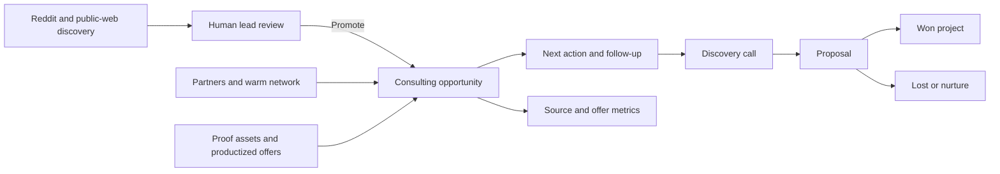

# AI Consulting Client Acquisition System Spec

## Status

- Document type: implementation specification
- Owner: Duncan Anderson
- Repository: `AI_Portfolio`
- Primary surface: protected admin portal
- Depends on: existing Reddit scanner, Codex automation lead scan, Supabase admin lead tables, consulting command-center data
- Source audit: `docs/ai-consulting-lead-generation-audit-2026-07-13.md`

## Objective

Implement a lightweight client-acquisition operating system that turns qualified public leads, partner relationships, warm introductions, proof assets, and follow-up commitments into consulting conversations and signed projects.

The system should optimize for:

- qualified conversations per hour of business-development work;
- same-day response to high-intent public opportunities;
- consistent partner and warm-network activity;
- reliable follow-up without automated spam;
- visible movement from lead to discovery, proposal, and won work;
- evidence about which sources, offers, and activities produce revenue.

This is not another lead-volume project. The scanners already find candidates. This project builds the operating layer that helps Duncan act on the right ones consistently.

## Primary User and Decision

Primary user: Duncan.

The command center should answer, in under one minute:

1. Who should I contact today?
2. What useful follow-up is due?
3. Am I meeting the weekly partner, warm-network, and proof-asset targets?
4. Which opportunities are moving toward revenue?
5. Which sources and offers are producing calls, proposals, and wins?

## Success Definition

The implementation succeeds when Duncan can run the following weekly system from one protected workspace:

- respond to high-intent leads the same business day;
- complete five targeted partner contacts per week;
- initiate three warm-network conversations per week;
- publish or materially advance one proof asset per week;
- use a structured 0/3/7/14-day follow-up sequence;
- promote a scanner lead into a real opportunity without duplicating its source record;
- see weekly conversion and pipeline metrics by source and offer;
- keep every outbound message under explicit human review.

## Hard Boundaries

1. No automatic comments, DMs, emails, applications, or proposals.
2. The product may draft messages, but Duncan must review and deliberately send them outside the system.
3. No private inbox scraping, browser-session reuse, credential exposure, or paid-gated marketplace data.
4. Do not create a second scanner or a second copy of every lead.
5. `admin_leads` remains the discovery record; promoted opportunities reference it.
6. A missing next action or missing follow-up date is a visible pipeline defect.
7. Conventional employment roles remain outside the consulting pipeline unless they satisfy the existing engagement and location eligibility gates.
8. Metrics must be derived from stored activities and stage changes, not manually invented totals.
9. Existing consulting records must be migrated before the hard-coded arrays are retired.
10. Historical source attribution must survive promotion, deduplication, and conversion.

## Current State

### Lead discovery

- Reddit candidates are published through the quote-grounded Reddit scanner.
- Broader public-source candidates are published through the Codex automation scan.
- Supabase stores discovery rows in `admin_leads`, source bundles in `admin_lead_sources`, and review state in `admin_lead_states`.
- `/portal/admin/leads` supports review, dismissal, notes, and basic action state.

### Consulting command center

- `src/lib/portal/admin/consulting.ts` contains hard-coded leads, projects, and tasks.
- `/portal/admin`, `/portal/admin/projects`, and `/portal/admin/tasks` read those arrays directly.
- The existing data includes valuable active context but is not a durable CRM or activity history.

### Main gap

The discovery board and consulting command center are separate. A promising scanner row cannot become a tracked opportunity with a durable activity timeline, follow-up schedule, offer, value, and conversion attribution.

## Product Model

Use five connected concepts:

1. **Discovery lead** — immutable source evidence from a scanner or manual source.
2. **Opportunity** — a qualified person or organization Duncan may work with.
3. **Activity** — a contact, reply, call, proposal, follow-up, referral request, or note.
4. **Commitment** — the next human action with an owner and due date.
5. **Growth asset** — a partner relationship, proof asset, offer, or partner-program milestone that can create future opportunities.

## Functional Scope

### 1. Lead-to-opportunity promotion

Add a `Promote to pipeline` action to `/portal/admin/leads`.

Promotion must:

- reference `source_id` and `lead_key` from the discovery row;
- prefill contact, business, source URL, pain point, offer match, and evidence;
- require Duncan to confirm opportunity type and next action;
- deduplicate against existing opportunities by normalized URL, email when known, organization, and linked discovery key;
- create the first activity as `qualified`;
- preserve the scanner row and its original evidence;
- change the lead review state to `converted` only after the opportunity write succeeds.

Supported opportunity types:

- `direct_client`
- `partner_overflow`
- `warm_referral`
- `past_client_expansion`
- `platform_program`
- `strategic_partner`

### 2. Consulting pipeline

Pipeline stages:

- `new`
- `qualified`
- `ready_to_contact`
- `contacted`
- `replied`
- `discovery_booked`
- `discovery_complete`
- `proposal_drafting`
- `proposal_sent`
- `won`
- `lost`
- `nurture`

Rules:

- `ready_to_contact` requires a response path and message angle.
- `contacted` requires a stored activity timestamp and channel.
- `discovery_booked` requires a scheduled date.
- `proposal_sent` requires a proposal date, value, currency, and reference or URL.
- `won` requires an agreed value or explicitly marked unknown value and a project handoff.
- `lost` requires a loss reason.
- Active stages require one future next action unless the stage is `won` or `lost`.

### 3. Daily action queue

Add a `Today` view to the admin command center with these sections:

1. High-intent leads discovered in the last 24 hours and not yet reviewed.
2. Qualified opportunities not contacted within eight business hours.
3. Follow-ups due or overdue.
4. Discovery calls and proposal actions due today.
5. Weekly target deficits for partner contacts, warm conversations, and proof assets.

Priority order:

1. explicit public RFP or direct paid request;
2. partner/overflow request;
3. replied opportunity;
4. discovery or proposal commitment;
5. due follow-up;
6. warm-network or partner target;
7. proof-asset work.

The page must show why each action is prioritized, not only a generic priority label.

### 4. Follow-up system

Default outreach cadence:

- Day 0: initial useful response;
- Day 3: add one implementation observation or clarifying question;
- Day 7: offer a bounded first step or relevant proof asset;
- Day 14: concise close-the-loop message and move to nurture if unanswered.

Requirements:

- cadence begins only after Duncan records an actual outbound activity;
- each follow-up is a separate commitment;
- completing one step creates the next suggested due date;
- Duncan can skip, reschedule, complete, or end a sequence;
- the system never marks a message as sent based only on generating a draft;
- follow-up copy must contain a new useful detail rather than “just checking in”;
- inbound replies automatically cancel pending no-response steps only when a reply is manually recorded or later imported through an approved integration.

### 5. Partner and warm-network pipeline

Provide dedicated filtered views using the same opportunity and activity model.

Weekly targets:

- five targeted partner contacts;
- three warm-network conversations.

Partner profiles should capture:

- person and organization;
- partner category;
- geography and client focus;
- complementary capabilities;
- likely overflow need;
- public contact path;
- relationship strength;
- last meaningful contact;
- next action;
- referrals given and received;
- opportunities influenced;
- notes and links.

Partner categories:

- accounting technology;
- bookkeeping or fractional CFO;
- automation consultancy;
- web/product agency;
- RevOps/CRM consultancy;
- vertical software implementer;
- independent specialist;
- platform partner program.

The outreach angle should be collaboration-specific: white-label delivery, API/integration implementation, documentation, exception handling, QA, rescue work, or client handoff. It must not read like a generic sales blast.

### 6. Proof-asset pipeline

Track one proof asset per week through:

- `idea`
- `briefed`
- `in_progress`
- `review`
- `published`
- `retired`

Proof asset types:

- case study;
- workflow teardown;
- architecture diagram;
- before/after process map;
- implementation checklist;
- short demo;
- buyer-facing work sample.

Each asset must define:

- intended buyer;
- decision it helps the buyer make;
- real or clearly labeled representative scenario;
- business problem and cost of the current process;
- proposed architecture or workflow;
- controls, exception handling, and human review;
- expected outcome or verified result;
- related offer;
- public URL when published;
- opportunities where it was reused.

Generic tool demos and unverified “five-minute proof of concept” work should not be promoted as flagship evidence.

### 7. Productized entry offers

Represent offers as structured records rather than scattered copy.

Initial offer set:

#### Workflow Diagnostic

- buyer: an operator who knows a process is painful but needs scope and priorities;
- outcome: current-state map, risk/control review, opportunity shortlist, recommended first implementation;
- pricing: configurable; no default price until Duncan approves it;
- duration: configurable target range;
- conversion path: diagnostic to automation sprint.

#### Automation Sprint

- buyer: a team with one clearly bounded workflow;
- outcome: working implementation, exceptions, test evidence, documentation, and handoff;
- pricing: configurable fixed fee or approved estimate;
- conversion path: sprint to support/next workflow.

#### Automation Rescue

- buyer: a team with a broken or unreliable existing automation;
- outcome: diagnosis, repair plan, bounded fix, monitoring, and recovery documentation;
- conversion path: rescue to managed support.

#### Ongoing Improvement Support

- buyer: an existing client with recurring maintenance or expansion needs;
- outcome: agreed support capacity, monitoring, prioritization, and incremental delivery;
- pricing: configurable retainer or day rate.

Each opportunity must have one primary offer match or `custom_scope`. Proposal and win metrics must retain that attribution.

### 8. Platform-program readiness

Seed three program records:

- Make partner training/directory;
- Zapier Solution Partner Program;
- n8n Expert Partner Program.

Each record should have:

- official URL;
- current status;
- eligibility requirements;
- evidence required;
- completed certifications or milestones;
- next action and due date;
- application date;
- decision/result;
- notes.

The n8n record should explicitly track the current three-active-customer prerequisite. Program requirements are externally changeable and must be manually verifiable rather than hard-coded as permanent truth.

## Data Model

Supabase is the durable source of truth. Use UUID primary keys, `created_at`, and `updated_at` timestamps on every mutable table.

### `consulting_opportunities`

| Column                  | Type                 | Notes                                     |
| ----------------------- | -------------------- | ----------------------------------------- |
| `id`                    | uuid                 | Primary key                               |
| `opportunity_type`      | text                 | Enum described above                      |
| `stage`                 | text                 | Pipeline stage                            |
| `name`                  | text                 | Person or opportunity label               |
| `organization`          | text                 | Business name                             |
| `contact_email`         | text nullable        | Only public or directly provided data     |
| `contact_url`           | text nullable        | Public response path                      |
| `pain_point`            | text                 | Buyer-facing problem                      |
| `evidence_summary`      | text                 | Explicit evidence and important gaps      |
| `source_family`         | text                 | Attribution                               |
| `source_id`             | text nullable        | Link to `admin_leads.source_id`           |
| `source_lead_key`       | text nullable        | Link to `admin_leads.lead_key`            |
| `primary_offer_id`      | uuid nullable        | Offer attribution                         |
| `estimated_value_cents` | bigint nullable      | Never parse free text into money silently |
| `currency_code`         | text nullable        | CAD, USD, GBP, etc.                       |
| `probability_percent`   | integer nullable     | Manual estimate, 0–100                    |
| `next_action`           | text nullable        | Required for active stages                |
| `next_action_due_at`    | timestamptz nullable | Required for active stages                |
| `last_contact_at`       | timestamptz nullable | Derived from activities                   |
| `discovery_at`          | timestamptz nullable | Booked call                               |
| `proposal_sent_at`      | timestamptz nullable | Stage evidence                            |
| `closed_at`             | timestamptz nullable | Won/lost date                             |
| `loss_reason`           | text nullable        | Required for lost                         |
| `notes`                 | text                 | Human notes                               |

Constraints:

- unique nullable composite index on `source_id, source_lead_key`;
- active stages require `next_action` and `next_action_due_at` at the application boundary;
- `estimated_value_cents >= 0`;
- `probability_percent between 0 and 100`.

### `consulting_activities`

| Column               | Type          | Notes                                                                                           |
| -------------------- | ------------- | ----------------------------------------------------------------------------------------------- |
| `id`                 | uuid          | Primary key                                                                                     |
| `opportunity_id`     | uuid nullable | Related opportunity                                                                             |
| `partner_id`         | uuid nullable | Related partner                                                                                 |
| `activity_type`      | text          | qualified, comment, dm, email, application, reply, call, proposal, referral, note, stage_change |
| `channel`            | text nullable | Reddit, Make, email, LinkedIn, call, etc.                                                       |
| `occurred_at`        | timestamptz   | Actual event time                                                                               |
| `summary`            | text          | What happened                                                                                   |
| `outcome`            | text nullable | Reply, no reply, meeting, pass, etc.                                                            |
| `external_reference` | text nullable | Public URL or internal reference                                                                |
| `created_by`         | text          | Initially `duncan` or `system`                                                                  |

### `consulting_commitments`

| Column            | Type                 | Notes                                                                                                   |
| ----------------- | -------------------- | ------------------------------------------------------------------------------------------------------- |
| `id`              | uuid                 | Primary key                                                                                             |
| `opportunity_id`  | uuid nullable        | Related opportunity                                                                                     |
| `partner_id`      | uuid nullable        | Related partner                                                                                         |
| `asset_id`        | uuid nullable        | Related proof asset                                                                                     |
| `commitment_type` | text                 | initial_response, follow_up, call, proposal, partner_contact, warm_intro, asset_work, program_milestone |
| `title`           | text                 | Human-readable action                                                                                   |
| `due_at`          | timestamptz          | Queue ordering                                                                                          |
| `status`          | text                 | todo, doing, waiting, done, cancelled                                                                   |
| `sequence_step`   | integer nullable     | 0, 3, 7, or 14 for follow-ups                                                                           |
| `completed_at`    | timestamptz nullable | Completion evidence                                                                                     |
| `notes`           | text                 | Draft angle or context                                                                                  |

### `consulting_partners`

Store the partner-profile fields defined above. Include `relationship_stage` values `research`, `ready`, `contacted`, `conversation`, `active_partner`, `dormant`, and `not_fit`.

### `consulting_proof_assets`

Store proof-asset stage, buyer, problem, outcome, offer relation, public URL, repository reference, published date, and reuse count.

### `consulting_offers`

Store name, slug, active state, buyer, outcome, deliverables, duration text, pricing model, approved price fields, and conversion path.

### `consulting_asset_uses`

Join table between proof assets and opportunities. This allows later measurement of whether a proof asset influenced replies, calls, or wins.

### `consulting_weekly_snapshots`

Optional materialized snapshot for reporting and audit history. Raw activities remain authoritative.

## Repository and Service Architecture

### New modules

- `src/lib/portal/admin/consulting-db.ts` — Supabase reads/writes and row mapping.
- `src/lib/portal/admin/consulting-metrics.ts` — pure metric calculations.
- `src/lib/portal/admin/consulting-cadence.ts` — follow-up date and next-step rules.
- `src/lib/portal/admin/consulting-validation.ts` — stage transition and required-field validation.

### Existing modules to evolve

- `src/lib/portal/admin/consulting.ts` — keep types and temporary seed compatibility, then remove hard-coded runtime reads after migration.
- `src/lib/portal/admin/leads.ts` — expose the canonical lead key and promotion-safe metadata.
- `src/lib/portal/admin/lead-db.ts` — support transactional or compensating promotion state updates.
- `src/app/portal/admin/leads/LeadsDashboard.tsx` — add promotion action and linked-opportunity state.
- `/portal/admin`, `/portal/admin/projects`, `/portal/admin/tasks` — replace array imports with server-side repository reads.

### New protected routes

- `GET /api/portal/admin/consulting/opportunities`
- `POST /api/portal/admin/consulting/opportunities`
- `PATCH /api/portal/admin/consulting/opportunities/:id`
- `POST /api/portal/admin/consulting/opportunities/promote-lead`
- `POST /api/portal/admin/consulting/activities`
- `POST /api/portal/admin/consulting/commitments`
- `PATCH /api/portal/admin/consulting/commitments/:id`
- equivalent minimal CRUD routes for partners, proof assets, offers, and platform programs

Every route must use the existing admin session check. Mutation routes validate payloads server-side and return structured errors.

## Admin Information Architecture

### `/portal/admin`

Make this the acquisition command center:

- today's action queue;
- overdue commitments;
- weekly target progress;
- pipeline value by stage;
- recent replies and proposal movement;
- scanner health warnings;
- shortcuts to leads, pipeline, partners, proof, and metrics.

### `/portal/admin/leads`

Keep discovery review. Add:

- `Promote to pipeline`;
- `View opportunity` when already promoted;
- consulting eligibility evidence;
- clearer distinction between discovered, reviewed, contacted, and promoted.

### `/portal/admin/pipeline`

Views:

- action table;
- stage board;
- opportunity detail with evidence, timeline, commitments, offer, value, and links;
- filters for source, opportunity type, offer, stage, currency, and due state.

### `/portal/admin/partners`

- partner list and relationship stage;
- weekly contact target;
- complementary capability and overflow angle;
- referral history;
- program-readiness subsection.

### `/portal/admin/proof`

- proof-asset pipeline;
- current weekly asset;
- buyer and offer coverage gaps;
- reuse history and influenced opportunities.

### `/portal/admin/metrics`

- weekly scorecard;
- source and offer funnels;
- median response time;
- activity-to-outcome rates;
- pipeline and closed value;
- false-positive and loss reasons.

## Metrics

### Activity metrics

- qualified opportunities created;
- initial responses recorded;
- partner contacts;
- warm-network conversations;
- proof assets advanced and published;
- follow-ups completed on time;
- median minutes from discovery to first response.

### Funnel metrics

- qualified to contacted;
- contacted to replied;
- replied to discovery booked;
- discovery to proposal;
- proposal to won;
- median days between stages;
- open pipeline value and weighted pipeline value;
- won value by source family and offer.

### Quality metrics

- scanner leads promoted;
- discovery rows dismissed by reason;
- promoted opportunities later marked not fit;
- proposals per hour of acquisition work;
- wins per source family;
- proof assets reused in active opportunities;
- partner-influenced opportunities and wins.

Metric denominators must be visible. For example, “reply rate” must show replies divided by contacted opportunities, not all discovered rows.

## Weekly Operating Rhythm

### Daily

- review new qualified leads;
- record same-day responses;
- complete due follow-ups;
- update replies, calls, and proposal stages;
- keep every active opportunity attached to a next action.

### Monday

- select five partner targets;
- select three warm-network contacts;
- choose the week's proof asset;
- review proposals and pipeline value;
- choose the primary offer emphasis for the week.

### Friday

- record outcomes and stage changes;
- review target completion;
- compare source and offer conversion;
- identify one acquisition lesson;
- carry forward only deliberately rescheduled commitments.

An optional Codex-generated daily or weekly brief may summarize these records after the database implementation is stable. It must remain report-only and must not send outreach.

## Migration Plan

1. Create Supabase tables, indexes, enums/check constraints, and row-level access strategy.
2. Write an idempotent seed script that migrates `consultingLeads`, `consultingProjects`, and `consultingTasks` from `consulting.ts`.
3. Preserve original IDs in a `legacy_id` column or migration map.
4. Compare seeded counts and important records against the current arrays.
5. Switch admin reads to Supabase with a temporary read-only fallback to static data.
6. Verify production data and remove the fallback in a later change.
7. Do not delete the original arrays until the migrated production records have been inspected.

Known records requiring context review during migration include Willow Grey Interiors, The Trauma Therapy Group/Gabriella, Alex Parker, and dormant historical leads. Status and dates must reflect current evidence rather than being blindly copied if newer evidence exists.

## Delivery Phases

### Phase 1 — Durable pipeline foundation

- Supabase schema and migration;
- consulting repository and validation modules;
- opportunity pipeline and activity timeline;
- commitments and Today queue;
- lead promotion;
- 0/3/7/14 follow-up generation;
- basic weekly activity targets.

Phase 1 is the minimum useful release.

### Phase 2 — Partner and proof engine

- partner profiles and weekly target workflow;
- warm-network tracking;
- proof-asset pipeline;
- structured offers;
- platform-program readiness records;
- asset reuse links.

### Phase 3 — Measurement and optimization

- source and offer funnels;
- response-time and stage-velocity metrics;
- pipeline value reporting;
- weekly snapshots;
- loss/false-positive analysis;
- optional report-only Codex briefs.

## Testing Strategy

### Unit tests

- stage-transition validation;
- required next-action behavior;
- follow-up date calculation;
- weekly target calculation;
- conversion funnels and denominators;
- currency-safe pipeline aggregation;
- discovery-key deduplication;
- lead promotion payload mapping.

### Integration tests

- promote a lead and link the opportunity;
- reject duplicate promotion;
- create an outbound activity and generate the next follow-up;
- record a reply and cancel the pending no-response step;
- send a proposal stage update with required evidence;
- mark won and create or link a project;
- migrate static consulting records idempotently;
- verify admin authorization on every mutation route.

### Browser verification

- Today queue at desktop and mobile widths;
- promote a lead from the lead detail panel;
- update an opportunity stage;
- complete and reschedule a follow-up;
- create a partner and proof asset;
- inspect weekly metrics and empty states;
- confirm no control implies a draft was actually sent.

### Production verification

- Supabase tables contain migrated records;
- the lead board and consulting pages agree on promoted state;
- refreshes preserve activity and commitment changes;
- weekly metrics reconcile to raw activity rows;
- no secrets or private message contents appear in client-rendered payloads;
- scanner publication continues to work unchanged.

## Observability and Failure Handling

- Log mutation failures with route, record type, and safe record identifier.
- Never log private message bodies, tokens, or credentials.
- Promotion must return a clear partial-failure response if opportunity creation succeeds but lead-state update fails; retrying must not duplicate the opportunity.
- Surface stale scanner status and failed publishing separately from an empty qualified-lead queue.
- Surface commitments missing required relations or due dates as data-quality warnings.
- Provide an admin-only reconciliation check for opportunities linked to missing or inactive discovery rows.

## Acceptance Criteria

1. Duncan can promote a Reddit or automation lead into exactly one consulting opportunity.
2. Promotion preserves source attribution, evidence, URL, lead key, and offer match.
3. The opportunity detail shows a durable activity timeline and future commitments.
4. Recording initial outreach can create the Day 3 follow-up; subsequent completion can schedule Days 7 and 14.
5. Generating or copying a draft does not mark outreach as sent.
6. A recorded reply cancels the pending no-response follow-up sequence.
7. Every active opportunity without a future next action appears as a visible defect.
8. The Today queue prioritizes fresh high-intent leads, replies, discoveries, proposals, and overdue commitments correctly.
9. The dashboard measures progress toward five partner contacts, three warm conversations, and one proof asset per week.
10. Partners, warm contacts, and platform programs use durable records with next actions.
11. Proof assets identify their buyer, decision, business problem, controls, outcome, offer, and reuse history.
12. Every opportunity has a primary offer or `custom_scope` before proposal stage.
13. Funnel metrics show their denominators and reconcile to stored activities.
14. Pipeline values never combine currencies into a misleading single total without conversion rules.
15. Existing consulting leads, projects, and tasks are migrated idempotently before static runtime reads are removed.
16. All admin mutation routes require a valid admin session and server-side validation.
17. No workflow sends outreach automatically.
18. Reddit and Codex lead publishing continue to pass their existing fixture, parser, and Supabase verification.
19. TypeScript, ESLint, production build, data migration verification, and browser acceptance checks pass.
20. The complete weekly operating rhythm can be run from the protected admin portal without maintaining a separate spreadsheet.

## Out of Scope

- autonomous outreach;
- inbox scraping or unsupervised reply classification;
- a general-purpose CRM for multiple salespeople;
- automatic proposal sending or contract execution;
- billing and accounting replacement;
- paid marketplace bidding;
- permanent currency conversion without a defined exchange-rate source;
- speculative AI lead scoring without explicit evidence;
- rebuilding the Reddit or Codex discovery scanners again.

## Open Decisions Before Phase 1 Build

These decisions should be confirmed during implementation planning, but they do not block schema scaffolding:

1. Approved price and duration ranges for each productized offer.
2. Whether the existing `/portal/admin/tasks` surface should become the commitments view or remain project-delivery-only.
3. Whether won opportunities should automatically create a consulting project or require a confirmation step.
4. Which loss-reason and partner-category values Duncan wants visible in filters.
5. Whether acquisition time should be recorded manually for the “per hour spent” metric in Phase 3.

## Recommended Implementation Order

1. Schema and migration fixtures.
2. Repository, types, and validation.
3. Read-only pipeline and migrated-data comparison.
4. Lead promotion and deduplication.
5. Activities, commitments, and follow-up cadence.
6. Today queue and command-center metrics.
7. Partner and warm-network views.
8. Offers and proof assets.
9. Funnel metrics and weekly review.
10. Optional report-only automations after live data is trustworthy.
