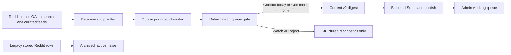

# Reddit Lead Scanner Hard Cutover Spec

## Decision

Replace the legacy Reddit lead monitor with the quote-grounded v2 scanner as the
only scanner available from the admin lead board.

This is a hard cutover of the working queue, not a deletion of historical data.
All existing Reddit rows remain in Supabase for audit and feedback history, but
are marked inactive and stop appearing on the board. Only leads from a successful
v2 run can appear in the working queues after cutover.

The target is not a large feed of automation-adjacent posts. The target is a
small queue of posts by a business owner, operator, manager, or responsible
employee who describes an owned operational problem that Duncan could credibly
help solve.

`0` surfaced leads is a correct result.

## Why This Is Needed

The current board combines two incompatible systems:

- The portal normally runs `scripts/reddit-lead-monitor.mjs`, selected by a
  `REDDIT_SCANNER` environment flag.
- v2 (`scripts/reddit-lead-scanner.mjs`) has quote verification, hard speaker
  exclusions, and a structured output, but is not the default portal path.
- Normal Reddit publishing deliberately leaves old `admin_leads` rows active.
  The board then merges every active stored row into the current digest.

The result is that a current v2-quality standard cannot improve the board while
legacy fiction, jobs, listicles, product promotion, and consumer questions are
still surfaced as active leads.

## Goals

1. Give the portal one Reddit scanner, one configuration contract, and one set
   of scan modes.
2. Surface only current-run leads with verified evidence and a clear human
   response posture.
3. Preserve old rows and actions for audit without displaying them as prospects.
4. Make weak retrieval visible in diagnostics, not visible as leads.
5. Measure quality from manually reviewed real posts rather than fixture-only
   success.
6. Keep Reddit use public-data-only. No automated comments, DMs, posting,
   inbox access, cookies, or login-only scraping.

## Non-Goals

- Do not change the separate Codex automation/public-web lead source.
- Do not introduce a lead quota or pad quiet days with weak results.
- Do not use author-history scraping or private Reddit data.
- Do not delete legacy `admin_leads` or `admin_lead_states` rows.
- Do not add schema fields unless the existing `active`, scan-batch, payload,
  and state fields prove insufficient during implementation.

## Product Contract

### Buyer Definition

A surfaced Reddit lead must have evidence of all applicable requirements below.

| Queue | Required evidence | Intended use |
| --- | --- | --- |
| `contact_today` | An operator or responsible employee; a quoted owned problem; a quoted request to hire, pay, or obtain implementation help; `consulting_fit=yes`; high classifier confidence | Duncan reviews a direct response or DM manually. |
| `comment_only` | An operator or responsible employee; a quoted owned business process and consequence; an advice or tool-shopping ask; `consulting_fit=yes`; medium or high confidence | Duncan decides whether to leave a useful public reply. |
| `watch` | Relevant but incomplete evidence | Retained only in structured diagnostics. Never displayed as a prospect. |
| `reject` | Any hard negative, missing ownership evidence, weak fit, stale post, or classifier/quote-verification failure | Retained only in structured diagnostics. |

The scanner must reject rather than infer when it cannot identify an owner,
operator, manager, or responsible employee.

### Hard Rejections

The following are never surfaced as working leads:

- product or agency promotion, articles, guides, listicles, case studies, and
  newsletter-style content;
- founder market research, co-founder/partner searches, and builder feedback;
- job posts, job seekers, and for-hire posts;
- personal consumer questions, including vendor-selection questions for a
  personally owned rental or consumer service;
- fiction, entertainment, or off-topic discussion;
- generic AI or best-tool discussion with no owned business process;
- low-budget/tiny requests that do not fit a consulting engagement.

Tool names, industry names, and words such as `automation`, `AI`, `CRM`, or
`spreadsheet` are discovery hints only. They are never positive evidence on
their own.

## Target Architecture



### Single Scanner Contract

The v2 files become authoritative:

- Scanner: `scripts/reddit-lead-scanner.mjs`
- Config: `config/reddit-scanner-v2.json`
- Fixtures: `scripts/fixtures/reddit-scanner-v2.json`
- State: `.tmp/reddit-scanner-state.json`
- Output: `outputs/reddit-leads/YYYY-MM-DD.md`, `latest-status.json`, and
  `latest-structured.json`

The legacy monitor and its config remain in the repository temporarily for
historical reference but are no longer callable from the portal. Remove the
legacy scanner only in a later cleanup PR after a stable v2 observation period.

### Portal and Deployment Contract

1. Remove the `REDDIT_SCANNER` conditional from
   `src/app/api/portal/admin/leads/run/route.ts`; always run v2.
2. Make `readLeadScanModes()` and `readLeadChannels()` read v2 configuration,
   or intentionally simplify the UI to one `Quality-first Reddit scan` mode.
3. Add the v2 scanner and config to `outputFileTracingIncludes` for both the
   run route and the portal route. Do not depend on a file that Vercel has not
   bundled.
4. Preserve `maxDuration` and streamed progress behavior already used by the
   scan route.
5. A successful run must publish the v2 digest/status through the existing
   bundled `publishLatestLeadDigest()` path; no spawned Blob publisher.

## Retrieval and Qualification Changes

### Discovery Strategy

Use two complementary discovery paths:

- **Global search** for self-identified business situations and explicit help
  requests. Search wording should center on ownership, recurrence, consequence,
  and an ask for help, rather than on automation tools.
- **Curated operator communities** as a supplemental source. Community
  allowlisting increases the chance of encountering business context but does
  not itself promote a post.

Every configured query must record fetched, prefiltered, classified, surfaced,
rejected, and manually-approved counts. A query with poor reviewed precision is
quarantined; it must not keep contributing candidates merely because it returns
volume.

The initial v2 config should remain intentionally small. Add a query or
community only after it has been evaluated against real posts. Industry packs
are optional context, never the scanner's identity.

### Qualification Pipeline

1. **Prefilter cheaply and conservatively.** Reject known disallowed
   subreddits, link-only posts, job shapes, promotion markers, stale posts, and
   historical source/author blocks before an LLM call.
2. **Classify only plausible posts.** The classifier identifies speaker,
   intent, consulting fit, confidence, and exact ownership/ask quotes.
3. **Verify quotes deterministically.** Quotes must occur verbatim in the post
   title or body. A paraphrase cannot promote a lead.
4. **Assign a queue deterministically.** Classifier failure, missing ownership,
   or `consulting_fit=no` always rejects.
5. **Do not demote a verified direct request solely because it came from global
   search.** Replace `openSearchMaxQueue: "watch"` with a source-confidence
   rule: an open-search post may enter a working queue only when it meets that
   queue's full evidence contract. Its source remains visible for review and
   feedback.
6. **Cap model work.** Keep a conservative candidate limit, rank candidates by
   evidence before classification, and stop after the cap. A run must report
   when candidates were skipped by the cap.

### Output Boundary

The Markdown digest and the portal parser must expose only `contact_today` and
`comment_only` blocks as leads. `watch` and `reject` remain in
`latest-structured.json` and status diagnostics, not in the published digest.

`leadsIncluded` must exactly equal the number of portal-visible Reddit leads.
The UI must not display a count that differs from the rows it is rendering.

## Data Cutover

### One-Time Archive

Use a reviewed, idempotent administrative operation to set:

```sql
update public.admin_leads
set active = false
where source_id = 'reddit'
  and active = true;
```

This is an archive operation, not deletion. It keeps:

- original row payloads;
- manual notes and action state in `admin_lead_states`;
- scan mode and batch provenance;
- the ability to inspect history directly in Supabase.

Run it only after the v2 deployment is ready and immediately before the first
successful v2 publication. The implementation must log the pre- and post-counts
and fail closed if the archive query errors.

### Normal v2 Publishing

After cutover, normal Reddit publishing must replace the active set for the
current v2 digest:

1. Mark active Reddit rows absent from the new v2 digest inactive.
2. Upsert current v2 rows with `active=true`, `last_seen_scan_mode`, and
   `last_seen_scan_batch`.
3. Preserve `first_seen_scan_mode` for a repeat lead.
4. Do not reactivate a legacy row unless it is independently rediscovered and
   passes the v2 gate in the current run.

Update `shouldReplaceMissingLeads()` accordingly. The existing exemption for
normal Reddit scans is incompatible with a current-only working queue.

### Board Read Model

`mergeStoredLeads()` must no longer merge all active stored Reddit rows into the
current digest. The board should render the published v2 digest as the source of
truth for current prospects. Stored rows are used only to hydrate user state for
matching current lead keys.

This prevents stale data from silently expanding the live queue and makes the
published status, digest headings, and visible row count agree.

## Feedback and Evaluation

### Review Workflow

Keep the existing feedback marker mechanism, but make it usable from the board:

- `good_lead`
- `bad_lead:<reason>`
- `quarantine_source:<query-or-subreddit>`
- `blocklist_author:<username>`

The UI should offer a concise lead verdict control for current Reddit rows.
Writing a verdict must update `admin_lead_states.notes` with the established
v2 marker format; it must not automate any outreach.

### Real-Post Evaluation Set

Before enabling the scheduled/manual production workflow, create a committed
fixture/replay set from recent public Reddit posts across:

- true direct requests;
- concrete operational pain;
- product promotion and content marketing;
- jobs and job seekers;
- consumer/vendor-selection posts;
- generic tool shopping;
- market research and builder feedback;
- fiction/off-topic results found by broad search.

Each example needs a human verdict, expected queue, and an explanation of the
minimum evidence or rejection reason. Keep API data limited to public post text,
metadata, and permalink; do not store credentials or private data.

### Acceptance Metrics

Evaluate the first three production-quality scans with a human review of every
visible Reddit row.

- `100%` of visible rows have a posted date, permalink, quote-verified
  ownership evidence, and a queue-compatible action.
- `0` visible rows are jobs, job seekers, sellers, content, fiction, consumers,
  market research, or generic AI chatter.
- At least `80%` of visible rows receive `good_lead` after review. The remaining
  `20%` must produce a specific new rejection rule, source quarantine, or
  fixture; they cannot simply stay unexplained.
- `contact_today` has `100%` explicit hiring, paid-help, or implementation
  request evidence.
- Portal count equals digest count equals `leadsIncluded` for every successful
  v2 run.
- A zero-lead run with healthy fetch/classification diagnostics passes.

Do not use volume, total fetched posts, or a target daily lead count as a quality
metric.

## Delivery Plan

### Phase 1: Contracts and Regression Coverage

1. Expand v2 fixtures with every recently observed failure class.
2. Add a digest/parser contract test proving only working queues are parsed as
   leads and `leadsIncluded` matches the parsed count.
3. Add a data-layer test proving a normal Reddit v2 publish deactivates absent
   rows and does not merge archived rows into the current digest.
4. Add a deployment trace assertion or build inspection that verifies v2 script
   and config inclusion.

### Phase 2: Scanner and Portal Cutover

1. Make v2 unconditional in the run route.
2. Move portal scan-mode/channel reads to the v2 config or reduce to one v2
   mode.
3. Adjust v2 global-search queue handling as specified above.
4. Make the digest current-queue-only and retain diagnostics structurally.
5. Update the portal UI copy/counts to distinguish `Contact today` from
   `Worth replying to`; do not describe watch items as leads.

### Phase 3: Data Archive and First Publication

1. Deploy the code changes with scanning disabled or without invoking a scan.
2. Confirm the production bundle contains v2 assets and the run route can read
   its config.
3. Execute the one-time archive with recorded counts.
4. Run one controlled v2 scan and publish it.
5. Verify Blob, `admin_lead_sources`, `admin_leads`, and the portal all agree.

### Phase 4: Quality Observation

1. Review every surfaced post from three scans.
2. Record verdicts and quarantine bad sources promptly.
3. Promote or add sources only after reviewed precision supports them.
4. Remove the legacy monitor/config in a separate cleanup PR after the metrics
   hold for the observation period.

## Verification Plan

### Static and Fixture Checks

```bash
node --check scripts/reddit-lead-scanner.mjs
node scripts/reddit-lead-scanner.mjs --fixtures
npm run lint
npx tsc --noEmit
```

### Bounded Live Smoke

Run only after explicit approval to use classifier credits. Use public Reddit
OAuth, a temporary output directory, conservative source limits, and no publish.
Verify:

- `latest-status.json` reports `scanMode=quote-grounded-v1`;
- the digest has only `contact_today`/`comment_only` headings;
- structured output retains watch/reject diagnostics;
- every visible lead has its required verified quotes;
- no production Blob or Supabase rows were changed.

### Production Cutover Proof

After the one-time archive and first v2 publish, query the live database with a
service-role server-side client and verify:

- `admin_lead_sources.id='reddit'` has `scanMode='quote-grounded-v1'`;
- all active Reddit rows belong to that current scan batch;
- active row count equals `leadsIncluded` and digest heading count;
- no archived legacy rows are returned by the board's read model;
- existing `admin_lead_states` remain intact;
- all tables retain their existing RLS protections and no service-role key is
  exposed to the client.

## Rollback

Rollback is a route/config switch, not data destruction:

1. Disable scan invocation if a v2 run produces an invalid digest or publish
   failure.
2. Keep archived rows inactive; do not automatically restore known-bad legacy
   leads to the working queue.
3. Restore the prior published Blob payload only if needed to recover portal
   availability, clearly marked as historical.
4. Fix the failed contract, add a fixture, and rerun the bounded smoke before a
   new production scan.

## Definition of Done

The cutover is complete only when the portal runs v2 without an environment
switch, v2 assets are bundled in production, legacy rows no longer appear as
active prospects, and three reviewed scans meet the acceptance metrics above.
