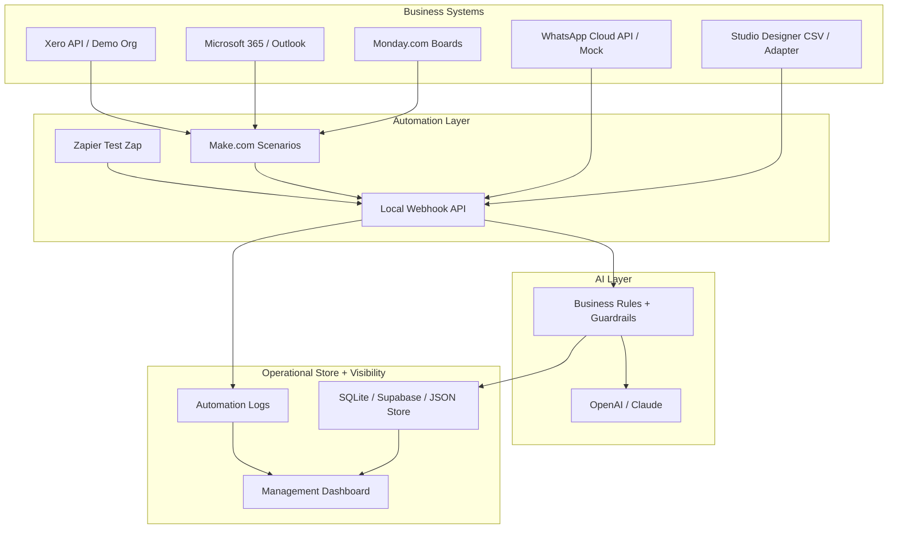

# WillowOps Prototype Spec

## Purpose

Build a hands-on prototype that mirrors the kind of automation and AI operating platform Willow Grey Interiors is hiring for: process mapping, connected business systems, reduced manual administration, management dashboards, practical AI assistance, and a team handoff/training layer.

This is not a production build for Willow Grey. It is a practice sandbox that lets us learn the tools, build credible patterns, and speak concretely in the July 1, 2026 call with Lucy Howson.

## Prototype Name

**WillowOps Control Tower**

A lightweight operating system for a luxury interior design firm that connects lead intake, project setup, client communication, procurement/admin tasks, finance visibility, and leadership reporting.

## Success Criteria

By the end of the prototype, we should be able to demo:

1. A new client enquiry flowing into a structured CRM/project pipeline.
2. Automatic creation of a project workspace, tasks, folder structure, and internal notifications.
3. AI-generated summaries and next-step recommendations from messy client/project notes.
4. Outlook email drafts or sends triggered by project stage changes.
5. WhatsApp-style client/supplier update messages generated and logged.
6. Xero invoice/payment status feeding project and leadership visibility.
7. Studio Designer project/procurement data represented in the operating model, even if initially via CSV/mock adapter.
8. A management dashboard showing active projects, blocked items, finance status, and automation health.
9. A Make.com scenario as the primary automation path.
10. A Zapier flow or Zapier-compatible webhook pattern as a secondary automation path.
11. A short training/handoff package explaining how the system works and how the team should use it.

## Tooling

### Primary Tools

- **Monday.com**: CRM/project board, task management, operational status.
- **Studio Designer**: design-project/procurement/accounting source. For prototype, use CSV/mock data unless live API/vendor access exists.
- **Microsoft 365 / Outlook**: email, calendar, file/folder operations through Microsoft Graph where possible.
- **Xero**: invoice/payment/accounting visibility.
- **WhatsApp Business Platform**: client/supplier messaging pattern.
- **Make.com**: primary automation orchestration.
- **Zapier**: secondary automation comparison/fallback.
- **AI platform**: OpenAI or Claude for summaries, classification, drafting, and workflow reasoning.
- **Local backend**: small API layer for webhooks, normalization, logging, and mock connectors.
- **Dashboard**: simple Next.js or static dashboard backed by local JSON/SQLite/Supabase.

### Verified Integration Surfaces

- Monday.com exposes a GraphQL platform API and webhooks for workflow events.
- Make supports webhooks/hooks for instant scenario triggers and automation orchestration.
- Zapier supports webhook/REST Hook trigger patterns.
- Microsoft 365 Outlook automation can be built through Microsoft Graph mail APIs.
- Xero exposes Accounting APIs and webhook events, including invoice activity.
- WhatsApp Business Platform Cloud API supports programmatic WhatsApp messaging.
- Studio Designer publicly documents its all-in-one interior design platform features, but a public developer API was not readily discoverable. Treat Studio Designer as an integration risk until the client confirms export/API/vendor access.

## Business Process To Model

The prototype should model one end-to-end lifecycle:

## Core Data Model

### Client

- `client_id`
- `name`
- `email`
- `phone`
- `preferred_contact_channel`
- `address`
- `lead_source`
- `budget_range`
- `style_notes`
- `status`

### Project

- `project_id`
- `client_id`
- `project_name`
- `property_location`
- `service_type`
- `stage`
- `lead_designer`
- `project_manager`
- `target_start_date`
- `target_install_date`
- `budget`
- `risk_status`
- `next_action`

### Design Item / Procurement Item

- `item_id`
- `project_id`
- `room`
- `supplier`
- `item_name`
- `status`
- `client_approval_status`
- `purchase_order_status`
- `invoice_status`
- `expected_delivery_date`
- `blocked_reason`

### Communication

- `communication_id`
- `project_id`
- `channel`
- `sender`
- `recipient`
- `subject`
- `body`
- `summary`
- `action_items`
- `sent_at`
- `logged_at`

### Finance Snapshot

- `project_id`
- `proposal_total`
- `invoiced_total`
- `paid_total`
- `outstanding_total`
- `xero_contact_id`
- `xero_invoice_ids`
- `payment_status`

### Automation Log

- `automation_id`
- `source_system`
- `event_type`
- `project_id`
- `status`
- `started_at`
- `finished_at`
- `error_message`
- `retry_count`
- `human_review_required`

## Prototype Architecture

## Build Phases

### Phase 0: Process Map and Operating Assumptions

Deliverables:

- Current-state map for enquiry to project completion.
- Target-state map showing source of truth per workflow.
- Bottleneck list ranked by business impact.
- Automation candidate list.

Exercises:

1. Map the current flow using a swimlane diagram:
   - Client
   - Design team
   - Project management
   - Procurement
   - Finance
   - Leadership
2. Identify handoffs that currently happen by memory, email, or chat.
3. Decide which system owns each object:
   - Monday owns project workflow/status.
   - Studio Designer owns design/procurement/accounting details if client confirms.
   - Xero owns invoices/payments if Xero remains finance source of truth.
   - Outlook/WhatsApp are communication channels, not primary data stores.

Acceptance criteria:

- Every process step has an owner, system of record, trigger, and next state.
- At least three automation opportunities are ranked by time saved and risk.

### Phase 1: Monday.com Operating Board

Create Monday boards:

1. **Client Enquiries**
   - New
   - Qualified
   - Discovery Scheduled
   - Proposal Sent
   - Won
   - Lost

2. **Design Projects**
   - Kickoff
   - Concept Design
   - Sourcing
   - Client Approval
   - Procurement
   - Installation
   - Aftercare
   - Complete

3. **Procurement Tracker**
   - Item Proposed
   - Client Approved
   - PO Required
   - Ordered
   - Acknowledged
   - Delayed
   - Delivered
   - Installed

4. **Automation Log**
   - Success
   - Needs Review
   - Failed
   - Retried

Key Monday fields:

- Client
- Project
- Stage
- Owner
- Priority
- Due date
- Blocked reason
- Next action
- Finance status
- Last client touch
- Automation status

Automations:

- When enquiry becomes `Qualified`, trigger discovery-call preparation.
- When project becomes `Kickoff`, create standard project tasks.
- When procurement item becomes `Delayed`, notify project manager.
- When finance status becomes `Overdue`, flag project risk.

Acceptance criteria:

- Boards can represent the full client/project/procurement lifecycle.
- Status changes can trigger external webhooks.

### Phase 2: Local Webhook and Normalization API

Build a small backend service with endpoints:

- `POST /webhooks/monday/status-change`
- `POST /webhooks/studio/project-export`
- `POST /webhooks/xero/invoice-event`
- `POST /webhooks/whatsapp/message`
- `POST /webhooks/make/run`
- `POST /webhooks/zapier/run`
- `GET /dashboard-data`

Responsibilities:

- Validate incoming payloads.
- Normalize different tools into the core data model.
- Write automation logs.
- Call AI only after required fields are present.
- Return clear success/failure responses.

Acceptance criteria:

- Each endpoint accepts a sample payload and writes a normalized event.
- Failed payloads are logged with a useful error.
- No API secrets are exposed in logs or responses.

### Phase 3: Make.com Primary Automation Scenario

Scenario: **New Qualified Enquiry to Project Kickoff**

Trigger:

- Monday item status changes to `Qualified` or `Won`.

Steps:

1. Receive Monday webhook in Make.
2. Fetch full item details from Monday.
3. Send normalized payload to local backend.
4. AI generates:
   - Client summary
   - Discovery call prep notes
   - Suggested questions
   - Internal next steps
5. Create/update Monday project item.
6. Create Outlook draft:
   - warm client follow-up
   - discovery call confirmation
7. Create internal notification/task.
8. Log automation result.

Acceptance criteria:

- One Monday status change creates a repeatable project kickoff package.
- Draft copy is useful but requires human approval before external send.
- Automation run appears in dashboard.

### Phase 4: Microsoft 365 / Outlook Workflow

Scenario: **Client Communication Drafting and Logging**

Trigger:

- Monday project stage changes or project manager requests update.

Steps:

1. Pull project context.
2. Generate a concise client update email.
3. Create Outlook draft or send internal review email.
4. Log communication against the project.
5. Update `Last client touch`.

Guardrails:

- Default to draft/review mode.
- Do not send client-facing email automatically until explicitly enabled.
- Keep tone aligned to luxury service: warm, polished, concise.

Acceptance criteria:

- Email draft includes project stage, next step, and any client decision needed.
- Communication is logged in the project timeline.

### Phase 5: WhatsApp Messaging Pattern

Scenario: **Supplier/Client Short Update**

For prototype:

- Use WhatsApp Cloud API test number if available, or a mock endpoint that stores messages as if sent.

Steps:

1. Project item changes to `Delayed`, `Awaiting Approval`, or `Delivery Confirmed`.
2. AI drafts a short WhatsApp message.
3. Human approves.
4. Message is sent or logged in mock mode.
5. Project communication history updates.

Acceptance criteria:

- Message is short, clear, and appropriate for WhatsApp.
- No sensitive financial or personal data is included.
- Every sent/mock message is logged.

### Phase 6: Xero Finance Visibility

Scenario: **Invoice Status to Project Risk**

Trigger:

- Xero invoice webhook or scheduled invoice sync.

Steps:

1. Receive invoice created/updated/paid event.
2. Match invoice to project by reference/contact/custom mapping.
3. Update finance snapshot.
4. If invoice overdue or unpaid above threshold, flag project risk in Monday.
5. Surface outstanding balance in dashboard.

Acceptance criteria:

- Demo invoice event updates project finance status.
- Overdue invoice generates a risk flag.
- Dashboard shows invoiced, paid, and outstanding totals.

### Phase 7: Studio Designer Adapter

Risk:

- Public API availability is unclear. We should not assume direct API access until Willow Grey confirms their plan, permissions, and vendor support.

Prototype approach:

1. Build a CSV import that simulates Studio Designer export data:
   - projects
   - design items
   - purchase orders
   - invoices
   - suppliers
2. Normalize CSV into design/procurement records.
3. Match records to Monday projects.
4. Surface item-level procurement risk in dashboard.

Optional live approach:

- If client provides API/vendor-supported access, replace CSV adapter with authenticated connector.

Acceptance criteria:

- Prototype can ingest a `studio_designer_items.csv` file.
- Procurement statuses update project risk and dashboard metrics.
- Integration boundary is clearly documented.

### Phase 8: Zapier Secondary Flow

Purpose:

- Demonstrate that the operating model is not locked to Make.com.

Scenario:

- Zapier Webhook receives a `project_ready_for_review` event from local backend.
- Zapier creates a task, sends a notification, or appends a row to a tracker.

Acceptance criteria:

- One Zapier flow runs from the same normalized backend event model.
- We can explain when we would choose Make vs Zapier:
  - Make for complex branching, webhooks, and operational workflows.
  - Zapier for simple team-friendly triggers/actions and quick admin automations.

### Phase 9: AI Assistant Layer

Use AI for:

- Client enquiry classification.
- Discovery call brief generation.
- Project status summaries.
- Draft emails and WhatsApp messages.
- Weekly leadership report.
- SOP/training assistant over internal documentation.

Do not use AI for:

- Final financial numbers.
- Legal commitments.
- Sending external messages without approval.
- Updating permanent business records without validation.

Prompt contracts:

- Input must include structured project context.
- Output must be JSON where automation consumes it.
- Every generated message includes confidence and missing-info fields.
- If required facts are missing, AI must ask for clarification rather than invent.

Acceptance criteria:

- AI outputs structured JSON for at least two workflows.
- Missing data is surfaced rather than guessed.
- Human approval is required for external communications.

### Phase 10: Management Dashboard

Views:

1. **Executive Overview**
   - Active projects
   - Projects at risk
   - Overdue client decisions
   - Outstanding invoice total
   - Procurement delays

2. **Project Pipeline**
   - Enquiry to completion stage counts
   - Projects by owner
   - Next actions due this week

3. **Finance**
   - Invoiced
   - Paid
   - Outstanding
   - Overdue
   - Project margin placeholder

4. **Automation Health**
   - Runs today
   - Success/failure rate
   - Failed automations
   - Human review queue

5. **Client Experience**
   - Last client touch
   - Messages awaiting approval
   - Discovery calls scheduled
   - Follow-ups overdue

Acceptance criteria:

- Dashboard can be demoed from seed data.
- Every metric links back to a project or automation log.
- Failed automations are visible, not hidden.

## Sample Data To Create

### Clients

- Charlotte Reeves, kitchen/living room redesign, high budget, Hampshire.
- James and Priya Shah, full home renovation, high complexity.
- Amelia Brooks, single-room refresh, fast timeline.

### Projects

- Reeves Residence
- Shah House
- Brooks Study

### Suppliers

- Bespoke Joinery Co.
- Heritage Lighting
- Atelier Fabrics
- Stone & Surface Ltd.

### Example Events

- New enquiry submitted.
- Discovery call completed.
- Proposal accepted.
- Procurement item delayed.
- Client approval overdue.
- Xero invoice paid.
- WhatsApp supplier update received.

## Demo Script

1. Show current-state process map and explain likely friction points.
2. Add or update a Monday enquiry.
3. Trigger Make scenario.
4. Show generated discovery brief and Outlook draft.
5. Promote enquiry to project kickoff.
6. Import Studio Designer mock procurement CSV.
7. Trigger a delayed supplier item.
8. Generate WhatsApp update draft.
9. Trigger Xero paid/overdue invoice event.
10. Show executive dashboard and automation log.
11. Explain training/handoff package.

## Training and Change Management Package

Deliverables:

- One-page system map.
- Source-of-truth guide.
- How to use Monday statuses.
- How to review AI-generated messages.
- How to handle failed automations.
- Admin checklist for adding a new project.
- 30-minute training agenda for design/project team.
- 30-minute leadership dashboard walkthrough.

Training principles:

- Keep team workflows simple.
- Do not expose technical complexity unless needed.
- Use human approval for anything client-facing early on.
- Build trust by showing logs, review queues, and fallback paths.

## Security and Governance

Rules:

- Store secrets in environment variables or platform credential stores.
- Do not put API keys in frontend code, Make notes, Zapier fields visible to users, or logs.
- Use read-only/demo accounts where possible.
- Mask client personal data in test logs.
- Require human approval for client-facing sends.
- Keep an audit log for every automated action.
- Separate prototype/mock data from real client data.

## What We Need To Build First

Recommended order:

1. Local backend with seed data and webhook endpoints.
2. Dashboard reading from local data.
3. Monday board structure and sample statuses.
4. Make webhook scenario from Monday to backend.
5. AI summary/draft endpoint.
6. Outlook draft/send proof.
7. Studio Designer CSV adapter.
8. Xero demo invoice event.
9. WhatsApp mock/send proof.
10. Zapier secondary webhook proof.
11. Training/handoff docs.

## Open Questions For Lucy

Ask these on the call:

1. Which tool is currently the source of truth for projects: Monday.com, Studio Designer, or something else?
2. Where does the team lose the most time today?
3. Are Monday.com boards already structured, or would part of the role be redesigning them?
4. Is Studio Designer being used for project management, procurement, accounting, or all three?
5. Does Studio Designer have export/API access available in their current plan?
6. Is Xero the actual accounting source of truth, or is Studio Designer handling some finance workflows?
7. How is WhatsApp used today: client comms, supplier comms, internal team, or all of the above?
8. Who approves client-facing communication today?
9. What dashboard would leadership actually look at weekly?
10. Would they prefer a day-rate fractional role, fixed discovery sprint, or milestone-based transformation project?

## References

- Monday.com Platform API and GraphQL: https://developer.monday.com/api-reference
- Monday.com webhooks: https://developer.monday.com/api-reference/reference/webhooks
- Make webhooks/hooks: https://developers.make.com/api-documentation/api-reference/hooks
- Make custom app webhooks: https://developers.make.com/custom-apps-documentation/app-components/webhooks
- Zapier REST Hook triggers: https://docs.zapier.com/integrations/build/hook-trigger
- Microsoft Graph Outlook mail API: https://learn.microsoft.com/en-us/graph/api/resources/mail-api-overview
- Microsoft Graph sendMail: https://learn.microsoft.com/en-us/graph/api/user-sendmail
- Xero Accounting API overview: https://developer.xero.com/documentation/api/accounting/overview
- Xero webhooks: https://developer.xero.com/documentation/guides/webhooks/overview/
- WhatsApp Business Platform: https://developers.facebook.com/documentation/business-messaging/whatsapp/about-the-platform
- WhatsApp Cloud API get started: https://developers.facebook.com/documentation/business-messaging/whatsapp/get-started
- Studio Designer platform overview: https://www.studiodesigner.com/
- Studio Designer implementation/onboarding features: https://www.studiodesigner.com/implementation/
